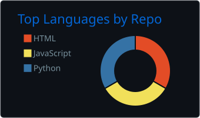
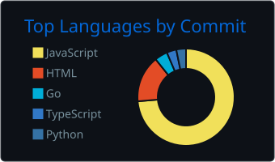
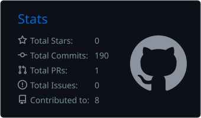
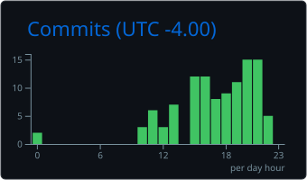

<h1 align="center">Felipe de Souza Rosa</h1>

  <b>Cyber Castle</b> · Desenvolvedor full-stack 
  Construindo produtos reais para pequenos negócios · Campo Grande, MS

  
  
  

---

Estudante de Sistemas de Informação na **UFMS** e fundador técnico da **Cyber Castle**.
Aprendo construindo sistemas de verdade — do schema do banco à interface — para negócios que precisam deles ontem.

Hoje meu foco é backend em **TypeScript** e aplicações mobile com **React Native**, com atenção especial a modelagem de dados e a gestão de projetos e produtos que precisam rodar sozinhos depois de entregues.

 

## Projetos

<table>
  <tr>
    <td width="50%" valign="top">
      <h3>Tenda Solar</h3>
      
<code>Código privado</code>

      
Plataforma de assinatura e locação de energia solar. Backend de gestão de contratos e app mobile para acompanhamento de consumo pelos clientes.

      

        
        
        
        
      

    </td>
    <td width="50%" valign="top">
      <h3><a href="https://github.com/cybercastle-gith/Varcolac">Vârcolac</a></h3>
      
<code>Open source</code>

      
Jogo social no estilo Cidade Dorme, com mecânicas próprias de papéis e votação que fogem do formato tradicional.

      

        
        
      

    </td>
  </tr>
  <tr>
    <td width="50%" valign="top">
      <h3><a href="https://github.com/Ararabots-UFMS/ssl-VICE">SSL-VICE</a></h3>
      
<code>Ararabots · UFMS</code>

      
Sistema de controle e estratégia para robôs autônomos na RoboCup Small Size League. Visão computacional, comunicação e tomada de decisão em tempo real.

      

        
        
      

    </td>
    <td width="50%" valign="top">
      <h3><a href="cybercastle.dev">Cyber Castle</a></h3>
      
<code>cybercastle.dev</code>

      
Estúdio de software focado em automação e sistemas sob medida para pequenos e médios negócios do Centro-Oeste.

      

        
      

    </td>
  </tr>
</table>

 

## Stack

  
   <b>Backend</b>

  
   <b>Frontend</b>

  
   <b>Infra</b>

 

## GitHub

  
  

  
  

<picture>
  <source media="(prefers-color-scheme: dark)" srcset="https://raw.githubusercontent.com/felipe27-dev/felipe27-dev/output/github-contribution-grid-snake-dark.svg">
  <source media="(prefers-color-scheme: light)" srcset="https://raw.githubusercontent.com/felipe27-dev/felipe27-dev/output/github-contribution-grid-snake.svg">
  
</picture>
